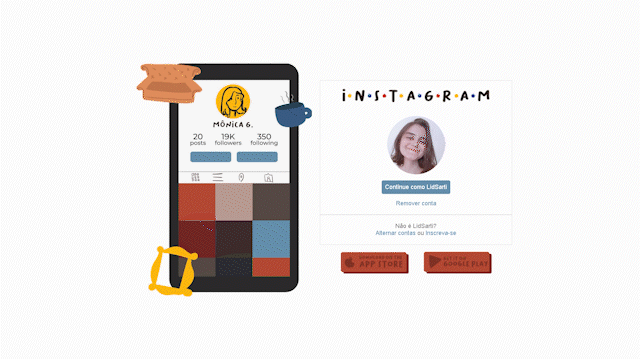
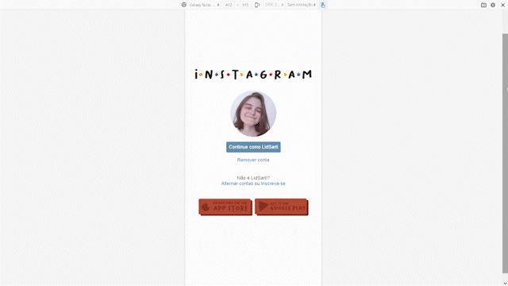

    <h1>🐈‍Página inicial do Instagram com o tema <i>Friends</i></h1>
    
Desenvolvi esse projeto dentro do Bootcamp da DIO "Impulso JavaScript Evolution", a proposta dele era desenvolver a página inicial do Instagram.

    
Para deixar ele com a minha cara resolvi inovar um pouco e usar o tema da série Friends, para isso desenvolvi novos assets utilizando o Adobe Illustrator. Também fiz uma animação, utilizando CSS, que altera imagens com as frases icônicas da série.

    
Gostei muito de desenvolver esse projeto, porque consegui colocar em prática todos os conhecimentos novos de HTML, CSS e Flexbox.

    <h2>Tecnologias usadas</h2>
    
    

    <h2>Resultado</h2>
    
    

